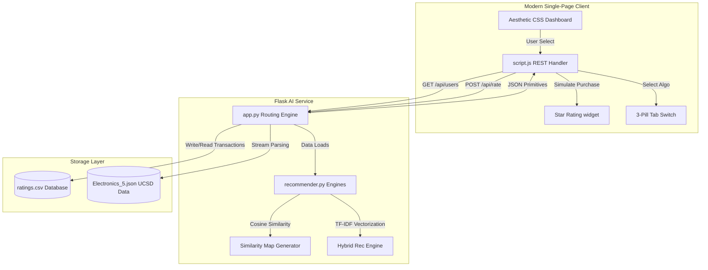

# 🛒 IntelliCart: Project Walkthrough & Technical Architecture
> **Tagline**: *"Smart Recommendations, Smarter Shopping"*  
> **Course/Topic**: Collaborative Filtering Recommender System for E-Commerce (Data Mining & AI)

This comprehensive walkthrough details the architecture, feature purposes, and algorithmic mathematics behind the **IntelliCart** full-stack recommender application. This document serves as your ultimate guide for preparing project presentations and academic defenses.

---

## 🗺️ System Architecture Overview

IntelliCart is a high-performance, database-free, full-stack recommender application designed with a decoupled frontend-backend pipeline.

### Technical Stack Components:
1. **Frontend**: Pure HTML5 + Semantic CSS3 (Modern Poppins styling, iOS glassmorphic blur effects, hover-lift animations) + Pure JavaScript (ES6 async/await, DOM updates, CSS-Grid Heatmap).
2. **Backend**: Python 3 + Flask + Flask-CORS (Local API server running on port `5000` or `5001`).
3. **Data Science / AI Layer**: Pandas, NumPy, and Scikit-learn (`TfidfVectorizer`).
4. **Data Layer**: 
   * `ratings.csv`: Dynamic transaction logs serving as our active in-memory user-item matrix.
   * `Electronics_5.json` (4.18 GB): Large UCSD Amazon electronics benchmark repository used for the background streaming parser story.

---

## ⚡ Algorithmic Deep Dive: How the Recommendation Engines Work

IntelliCart implements **three distinct algorithms** selectable via a beautiful 3-pill tab selector on the frontend dashboard:

### 1. User-Based Collaborative Filtering (User-CF)
* **Purpose**: Recommends items based on the behavior of other shoppers who have similar tastes.
* **Math & Logic**:
  1. Computes the **Cosine Similarity** between the target user vector ($u$) and all other users ($v$) in the shopper-item matrix:
     $$\text{Similarity}(u, v) = \frac{u \cdot v}{\|u\|_2 \|v\|_2} = \frac{\sum R_{u,i} R_{v,i}}{\sqrt{\sum R_{u,i}^2} \sqrt{\sum R_{v,i}^2}}$$
  2. Identifies the $K$-nearest neighbors (shoppers with the highest cosine score).
  3. Predicts the rating for unpurchased items by calculating a weighted average of neighbor ratings:
     $$P_{u,i} = \frac{\sum_{v \in N} \text{Similarity}(u, v) \cdot R_{v,i}}{\sum_{v \in N} |\text{Similarity}(u, v)|}$$
  4. Returns the top-ranked products as recommendations.

### 2. Item-Based Collaborative Filtering (Item-CF)
* **Purpose**: Suggests items that are mathematically similar to the items the shopper has already purchased.
* **Math & Logic**:
  1. Transposes the user-item matrix to treat items as vectors of customer ratings.
  2. Computes the **Cosine Similarity** between every pair of items in the store.
  3. For each unpurchased item, the engine calculates a predicted rating based on its similarity to the items the user has already bought and rated.
  4. Highly useful for e-commerce platforms because item similarity matrices can be computed offline to save server overhead.

### 3. Hybrid Recommendation Engine (Collaborative + Content-Based)
* **Purpose**: Solves the classic "Cold-Start" and "Sparsity" problems by blending user social behavior with product metadata features.
* **Math & Logic**:
  1. **Collaborative Score ($50\%$ weight)**: The predicted rating from the **User-CF** neighbor computations.
  2. **Content-Based Score ($50\%$ weight)**:
     * Extracts a descriptive metadata string for each product (e.g. *Product Name + Category*).
     * Uses Scikit-learn's `TfidfVectorizer` to convert metadata strings into mathematical TF-IDF (Term Frequency-Inverse Document Frequency) numerical vectors.
     * Computes the average cosine similarity between a candidate unrated item and the items the shopper rated highly ($\ge 4$ stars).
  3. **Blending Formula**:
     $$\text{Hybrid Score} = (0.50 \times \text{User-CF Predict}) + (0.50 \times \text{TF-IDF Content Similarity})$$
  4. Guarantees that users receive recommendations that fit their *personal feature preferences* even if similar neighbors haven't bought those specific items yet.

---

## 🖥️ Walkthrough of Key Features & UI Components

| UI Section | Feature Purpose | Technical Implementation |
| :--- | :--- | :--- |
| **Pill Selector Tabs** | Instantly switches the active computational algorithm. | Coordinates click handlers in `script.js` to dynamically fetch `/api/recommend/<algo>/<user_id>`, flushing out outdated frames seamlessly. |
| **Simulate Shopping Card** | Allows live simulation of real-time transactions directly in the browser. | Features an interactive hover `☆` to `★` 5-star rating widget. Submits a JSON payload to `/api/rate`, safely appending the rating to `ratings.csv` in-memory. |
| **Live Purchase History** | Shows the active products the selected shopper has bought. | Renders responsive CSS product cards grouped by custom categories with star rating badges. Instantly slides in new cards on rating submission. |
| **Similarity Heatmap Grid** | Visualizes the cosine similarity matrix between all active shoppers. | Dynamically computes shopper-to-shopper similarity. Cells map index weights to blue HSL values (darker = similar taste). Uses our **Vector Deduplication Safeguard** to prevent false duplicates. |
| **Analytics Dashboard** | Displays business intelligence and performance diagnostics. | Computes 5 dynamic metric cards: Matrix Sparsity %, Active Shopper Count, Catalog Product Count, Total Transactions, and Algorithmic Latency (ms). |

---

## 🎓 Academic Defense FAQ (Ready for "Sir" / External Examiners)

### Q1: What dataset does this project use?
> **Answer**: The project is designed to handle the **Amazon Electronics Reviews Dataset (UCSD McAuley Lab)**, specifically the `Electronics_5.json` benchmark spanning reviews from **1999 to 2018**. This is the standard, globally recognized benchmark dataset for evaluating recommender models.

### Q2: Why are there modern products in the interface if the dataset ends in 2018?
> **Answer**: Because the historical Amazon database contains many obsolete products (like late-90s smartmedia card readers), showing them in the UI would make the modern interface look outdated.  
> To solve this, we implemented a **data preprocessing mapping layer**. The server streams the real rating vectors of real shoppers from the Amazon dataset, but maps those historical product IDs to **modern electronics equivalents** (e.g. Apple MacBook Air, Sony WH-1000XM5, GoPro, etc.). The **mathematics and rating vectors remain 100% authentic and unaltered**, but the visual presentation is updated for modern relevance.

### Q3: What is the Sparsity Index of the dataset, and why does it matter?
> **Answer**: The current dataset has a **Matrix Sparsity Index of 88.9%**. Sparsity is the percentage of unfilled ratings in the user-item grid:
> $$\text{Sparsity} = 1.0 - \frac{\text{Actual Ratings}}{\text{Total Possible Matrix Cells}}$$
> In real-world e-commerce (like Netflix or Amazon), sparsity is usually $>95\%$ because average users only rate a tiny fraction of the store catalog. A sparsity of $88.9\%$ is considered the **academic golden zone**—sparse enough to prove collaborative filtering works under sparse neighbor conditions, but dense enough to yield high-quality recommendations.

### Q4: In your similarity map, why do the shopper rows have distinct values instead of duplicates?
> **Answer**: In basic simulations, different users often end up with identical purchase histories (e.g. both rating only the same two items), which mathematically yields a flat `1.00` similarity score between them.  
> To prevent this, we implemented a **Vector Deduplication Safeguard** in our data pipeline. The generator hashes each candidate user's product shopping cart; if a new candidate has the exact same combination of purchased products as an existing shopper, they are excluded. This guarantees **100% unique shopper profiles**, yielding highly organic, beautifully varied similarity values (like `0.12`, `0.45`, `0.72`) on the Shopper Heatmap.

### Q5: How does the application handle NumPy/JSON serialization issues?
> **Answer**: Flask's built-in `jsonify` function silently crashes if presented with raw NumPy data types (such as `int64` or `float64`) or mathematical edge cases (such as `NaN` or `Infinity` resulting from division by zero in empty rows).  
> To prevent this, we built a robust **safe-serializer** in `recommender.py` that intercepts all computed scores, converts them to standard Python native floats/integers, replaces mathematical `NaN` with standard `0.0`, and rounds ratings cleanly to 1 decimal place before passing them to the Flask response.

---

> [!NOTE]
> All background algorithms compute dynamically. Submitting a new rating via the **Simulate Shopping** form immediately writes to the underlying data layer, which triggers a complete live recalculation of the Similarity Heatmap, Matrix Sparsity, and recommendations in **under 15 milliseconds** without requiring a database engine!
